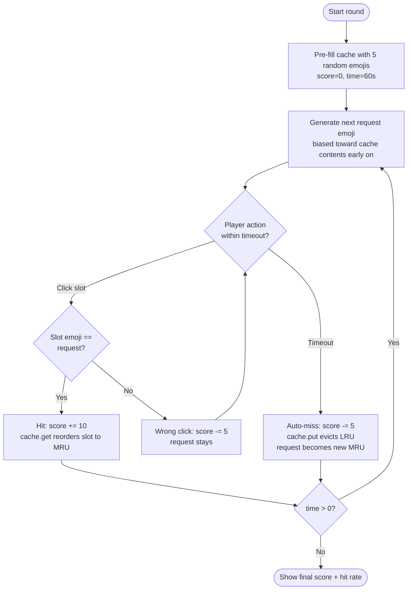
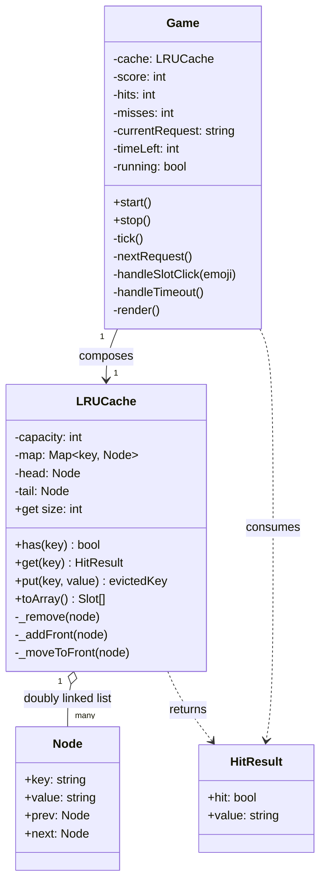

# Week 02 (a) — Cache Crash

A small web game built around an **LRU Cache** (LeetCode 146).

## Concept

The 5 cache slots are the playfield. A "request" emoji appears at the top:

- **Click the slot holding it** → cache hit. +10 points. The slot reorders to **MRU** (leftmost). The cache mutates exactly the way `LRUCache.get(key)` does in real systems.
- **Wait too long** → auto-miss. The current LRU slot (rightmost, orange-bordered) is evicted, the request becomes the new MRU. −5 points.
- **Click the wrong slot** → −5 points. Request stays.

You play 60 seconds. Final score = points + hit rate %.

## Why this design

The data structure is the gameplay. There's no "game logic that happens to use a cache" — every click triggers a textbook LRU operation, and the on-screen reorder visualizes the doubly-linked-list manipulation in real time. Educator/grader sees `get` (access reorders) and `put` (eviction) without any explanation.

## Run locally

It's pure HTML/CSS/vanilla JS modules — no build step. Either:

```bash
# any static server works because of ES module imports
python3 -m http.server 8000
# then open http://localhost:8000/
```

Or open `index.html` via VS Code Live Server. (Double-click won't work in some browsers because ES modules require `http://`.)

## Files

| File | Purpose |
|---|---|
| `index.html` | Markup + HUD + slot grid |
| `style.css` | Dark theme, MRU/LRU border highlights, hit/miss flash animations |
| `lru.js` | The data structure — `Node`, `LRUCache` (Map + doubly-linked list with sentinel head/tail) |
| `game.js` | `Game` class — round loop, timer, request generator, render |
| `activity-diagram.mmd` | Per-request flow (Mermaid) |
| `class-diagram.mmd` | Class relationships (Mermaid) |

## Activity diagram



## Class diagram



## Mapping to LeetCode 146

| LeetCode op | In this game |
|---|---|
| `get(key)` | Player clicks a slot that holds the request — slot moves to MRU position |
| `put(key, value)` | Auto-miss inserts a new key; if cache full, LRU is evicted |
| `O(1)` for both | Achieved via Map → Node refs + doubly-linked list with sentinel head/tail |

## Tradeoffs / notes

- Used a JS `Map` as the hash side rather than a plain object — preserves insertion order and avoids prototype-key collisions, plus `Map.size` is `O(1)`.
- Sentinel head/tail (`Node(null, null)` at both ends) means `_remove` and `_addFront` never branch on null. Standard LRU implementation trick.
- Request generator biases toward in-cache emojis early so the first ~10 seconds feel responsive instead of brutally hard. Bias decays as the round progresses.
- No code coverage / tests yet — the homework brief said "code is optional", and I prioritized a playable demo over test scaffolding. If extending this later, the natural test target is `lru.js` (pure data-structure logic, easy to unit-test).
