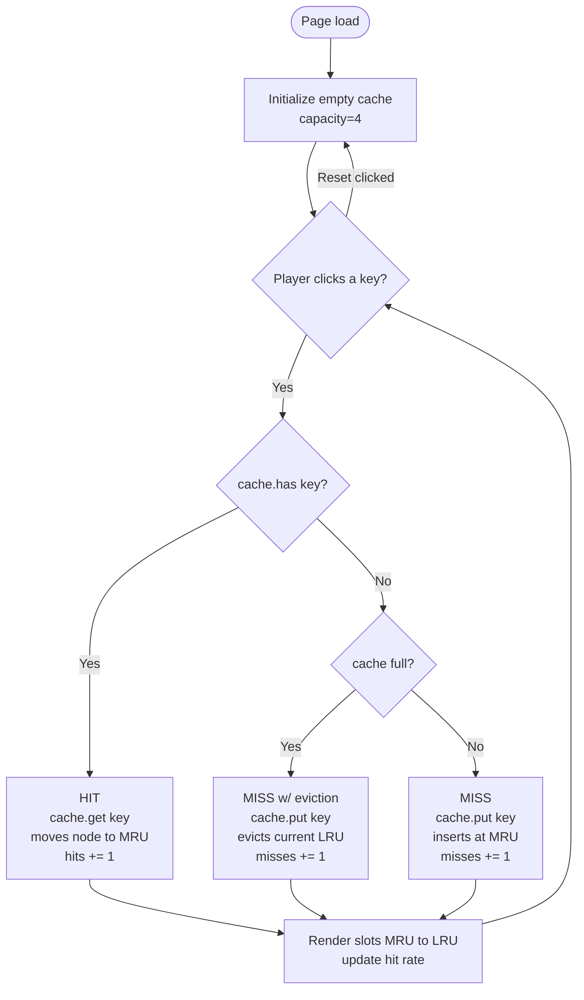
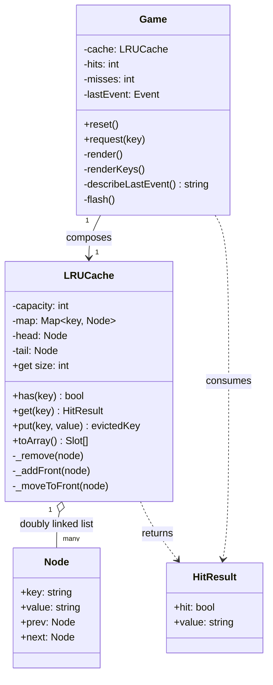

# Week 02 (a) — Cache Crash

A live **LRU Cache** sandbox (LeetCode 146). Click a key, watch the cache react.

## Concept

8 fixed keys (A–H). 4 cache slots. Click any key:

- **In cache** → **HIT**. `cache.get(key)` is called — the node is unlinked and reinserted at the head, becoming MRU.
- **Not in cache** → **MISS**. `cache.put(key)` is called — if the cache is full, the LRU (tail) is evicted; the new key enters at the head.

Hits / misses / hit rate update each click. There is no timer and no scoring — the cache state IS the gameplay. Cached keys glow on the key row so you can plan whether the next click will hit or miss.

## Why this design

The data structure is the playfield. Every click is exactly one textbook LRU operation, and the slot reorder visualizes the doubly-linked-list manipulation in real time. An educator can watch `get` (access reorders) and `put` (eviction) happen with no extra plumbing.

## Run locally

Pure HTML/CSS/vanilla JS modules — no build step. Either:

```bash
# any static server works because of ES module imports
python3 -m http.server 8000
# then open http://localhost:8000/
```

Or open `index.html` via VS Code Live Server. (Double-click won't work in some browsers because ES modules require `http://`.)

## Files

| File | Purpose |
|---|---|
| `index.html` | Markup — HUD, key row, cache slots, reset |
| `style.css` | Dark theme, MRU/LRU border highlights, hit/miss flash on slots, `.cached` highlight on keys |
| `lru.js` | The data structure — `Node`, `LRUCache` (Map + doubly-linked list with sentinel head/tail) |
| `game.js` | `Game` class — handles a click, calls `cache.get` / `cache.put`, renders |
| `activity-diagram.mmd` | Per-click flow (Mermaid) |
| `class-diagram.mmd` | Class relationships (Mermaid) |

## Activity diagram



## Class diagram



## Mapping to LeetCode 146

| LeetCode op | In this sandbox |
|---|---|
| `get(key)` | Click a cached key — slot reorders to MRU position |
| `put(key, value)` | Click an uncached key — inserts at MRU; if full, current LRU is evicted |
| `O(1)` for both | Achieved via Map → Node refs + doubly-linked list with sentinel head/tail |

## Suggested click sequences to demo each path

| Sequence | What it shows |
|---|---|
| `A B C D` | Four misses, fills the cache. Slots: `D C B A` (MRU → LRU). |
| then `A` | Hit. `A` jumps to MRU: `A D C B`. |
| then `E` | Miss with eviction. `B` (LRU) is evicted, `E` enters at MRU: `E A D C`. |
| then `A` again | Hit. `A` to MRU: `A E D C`. |

## Tradeoffs / notes

- Used a JS `Map` as the hash side rather than a plain object — preserves insertion order and avoids prototype-key collisions, plus `Map.size` is `O(1)`.
- Sentinel head/tail (`Node(null, null)` at both ends) means `_remove` and `_addFront` never branch on null. Standard LRU trick.
- Removed timer/scoring/hit-bias from an earlier draft. The simulation noise was hiding the data-structure operation; turn-based makes each `get`/`put` legible.
- No code coverage / tests yet — the homework brief said "code is optional", and I prioritized a playable demo over test scaffolding. If extending this later, the natural test target is `lru.js` (pure data-structure logic, easy to unit-test).
