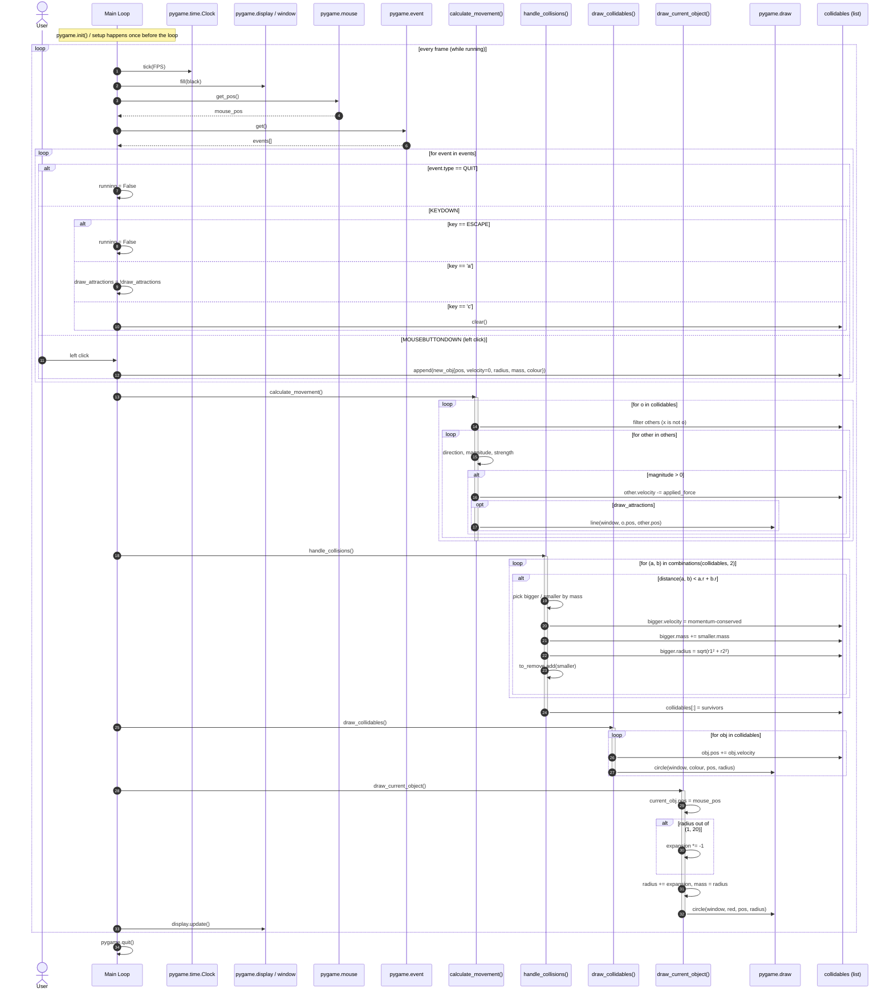

# Week 02 (b) — Sequence diagram

Reverse-engineered sequence diagram for the pygame collision-simulation script.

## Files

- [`source.py`](./source.py) — original script under analysis
- [`sequence.mmd`](./sequence.mmd) — Mermaid (canonical, renders below on GitHub)
- [`sequence.puml`](./sequence.puml) — PlantUML version (classic UML look, for printable submission)
- [`sequence.uml`](./sequence.uml) — StarUML 1 (XPD) format, importable via `File → Import → StarUML 1 file (.uml)`
- [`generate_uml.py`](./generate_uml.py) — script that generates `sequence.uml` from a Python message list (re-run after edits)

## Modeling decision

The script is a **game loop** — it doesn't have a single linear "happy path". I model **one frame** of the `while running` loop and wrap it in an outer `loop` block so the diagram represents the per-frame work the program repeats 60 times per second.

Per-pair iterations inside `calculate_movement` and `handle_collisions` are shown as nested `loop` blocks rather than expanded — the structure (`for o → for other`, `for (a,b) in combinations`) is the interesting part, not each individual call.

### Participants

| Lifeline | Why it's separate |
|---|---|
| `User` | Real-world actor producing input events |
| `Main Loop` | Orchestrates the frame |
| `pygame.time.Clock` | Timing |
| `pygame.display` / `window` | Frame buffer |
| `pygame.mouse` / `pygame.event` | Input sources |
| `calculate_movement()` | Pure-physics step (gravity) |
| `handle_collisions()` | Reactive step that mutates `collidables` |
| `draw_collidables()` / `draw_current_object()` | Render step |
| `pygame.draw` | Drawing primitives |
| `collidables : list` | Shared state — broken out so mutations are visible |

## Diagram (Mermaid)



## Map: code → diagram

| Code section | Diagram element |
|---|---|
| `while running:` (line ~96) | Outer `loop every frame` block |
| `for event in pygame.event.get():` | Inner `loop for event in events` |
| `if event.type == QUIT / KEYDOWN / MOUSEBUTTONDOWN` | Nested `alt` inside event loop |
| `calculate_movement()` body | `loop for o → loop for other → alt magnitude > 0 → opt draw_attractions` |
| `handle_collisions()` body | `loop combinations → alt distance < r1+r2` |
| `draw_collidables()` | `loop for obj` with mutation + `pygame.draw.circle` |
| `draw_current_object()` | `alt radius out of (1, 20)` plus mutation + draw |
| `pygame.display.update()` | Final per-frame call |
| `pygame.quit()` | Single message after the outer loop ends |

## Rendering

- **Mermaid:** GitHub renders it inline. Locally: `npx -p @mermaid-js/mermaid-cli mmdc -i sequence.mmd -o sequence.png`
- **PlantUML:** `plantuml sequence.puml` → `sequence.png`.
- **StarUML:** open StarUML → `File` → `Import` → `StarUML 1 file (.uml)` → pick `sequence.uml`. The diagram opens as a real editable Sequence Role Diagram.

### Caveat for the StarUML version

StarUML 1's sequence diagrams predate UML 2.0 combined fragments — there's no `loop` / `alt` / `opt` box element. The control flow from the Mermaid version is **flattened** in `sequence.uml`: iteration / branching is encoded as a `[loop ...]` / `[alt ...]` / `[opt ...]` prefix in the message label. Reading order is preserved; the visual boxes are not.

If you need the boxes for submission, render Mermaid or PlantUML to PNG and submit that alongside the `.uml` for the editable model.

### Regenerating `sequence.uml`

The `.uml` file is built by `generate_uml.py` from a Python list of `(sender, receiver, label)` tuples. To change the diagram, edit the `MESSAGES` / `LIFELINES` list in the script and re-run:

```bash
python3 generate_uml.py > sequence.uml
```

The script uses deterministic GUIDs so re-runs produce stable diffs.

## Notes / open questions

- The original script keeps state in module-level globals (`collidables`, `gravity`, `current_obj`). I drew `collidables` as its own lifeline so the mutations are visible, but `gravity` / `expansion` / `draw_attractions` are inlined into the calling participant — drawing every global as its own lifeline would be noisy without adding information.
- `mouse_pos` is read inside `draw_current_object()` via the global. The diagram shows it being passed implicitly; in a strict OO refactor it should be a parameter.
